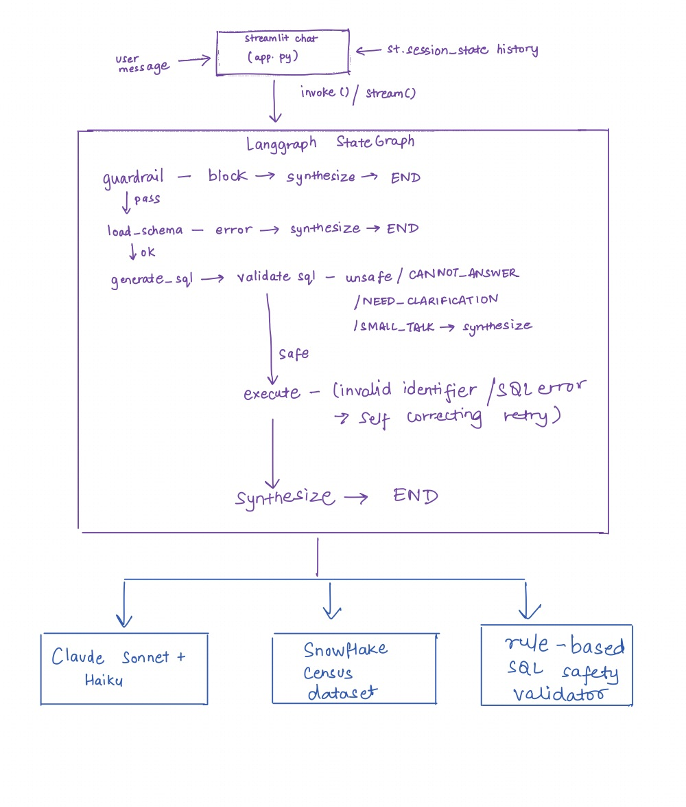

# Census Chat — an interactive chat agent over US Census data

An interactive chat agent that answers natural-language questions about US
demographics, housing, income, education, employment, and other indicators
from the American Community Survey (ACS). Built on **Streamlit +
LangGraph + Anthropic Claude + Snowflake**.

**What it does:**
- Turns plain-English questions into live Snowflake SQL, grounded in real
  ACS data (no hallucinated numbers).
- **Auto-renders charts** — bar charts for rankings, line charts for year
  trends, grouped bars for state × year comparisons — whenever the
  result shape justifies a visualization.
- Preserves multi-turn conversation context (e.g. *"What about Texas?"*
  resolves against the prior turn).
- Degrades gracefully on off-topic, ambiguous, out-of-coverage, or
  conversational messages via a four-sentinel output contract
  (`CANNOT_ANSWER`, `NEED_CLARIFICATION`, `SMALL_TALK`, or SQL).
- Self-corrects on SQL-compilation errors by re-prompting Sonnet with
  the real column list from `INFORMATION_SCHEMA`.
- Exposes the generated SQL and the raw returned rows behind a
  collapsible **"View query"** panel under each answer, with a
  **Download CSV** button so you can take the data with you.

> **Live demo** → **<https://census-agent-assignment.streamlit.app/>**
> **Data source** → [SafeGraph US Open Census Data](https://app.snowflake.com/marketplace/listing/GZSUZ7C5UB/safegraph-us-open-census-data-neighborhood-insights-free-dataset), Snowflake Marketplace.

---

## For evaluators — how to try the demo

**Just click the link above.** No setup, no credentials, no local installation.

The app opens in your browser, you type a question in the chat box, and the
agent answers with live numbers pulled from Snowflake. A collapsible
"View query" panel under each answer shows the SQL that was executed so you
can verify the numbers came from the dataset.

Suggested starting prompts to explore the main paths:

- *"What's the population of California?"* — simple single-value answer
- *"Which state has the highest median household income?"* — multi-row ranking, auto-rendered as a bar chart
- *"Compare population of California against Texas over the years"* — two states × two years, auto-rendered as a multi-series chart
- *"What percentage of people in Texas have a college degree?"* → follow with *"What about New York?"* — tests multi-turn context
- *"What is the weather in New York?"* — off-topic guardrail
- *"What's the population?"* — ambiguous query; agent asks for clarification
- *"Show me the population of California in 2005."* — year out of coverage; agent declines gracefully and offers the closest available year
- *"thanks!"* — conversational closer; warm reply with no query

Typical response time: **3–10 seconds**. The first query after the app
goes idle may add ~30s cold-start while Snowflake spins up its warehouse.

---

## Architecture



### Node responsibilities

| Node           | Model         | What it does |
|----------------|---------------|--------------|
| `guardrail`    | Claude Haiku  | Fast on-topic / off-topic classifier. Off-topic queries get a polite redirect without a Snowflake round-trip; small talk ("thanks", "bye") passes through to a warm reply. |
| `load_schema`  | —             | Loads a compact (<3 KB) schema summary from `INFORMATION_SCHEMA`, cached for the life of the process. Includes per-state enumeration so the LLM knows territories (e.g. PR) are in scope. |
| `generate_sql` | Claude Sonnet | Authors one Snowflake `SELECT` against the schema, using conversation history for follow-ups. Can emit one of three sentinels instead of SQL: `CANNOT_ANSWER: …`, `NEED_CLARIFICATION: …`, or `SMALL_TALK: …`. |
| `validate_sql` | rule-based    | Statically enforces: `SELECT` only, no DDL/DML keywords, no `--` / `/* */`, no statement chaining. LLM-authored SQL is treated as untrusted. |
| `execute`      | —             | Runs the SQL with a 45-second statement timeout. On compilation errors (invalid identifier, syntax, ambiguous column), invokes a self-correcting retry that fetches the real column names from `INFORMATION_SCHEMA` and re-prompts Sonnet. |
| `synthesize`   | Claude Sonnet | Grounds a natural-language answer in the returned rows. Warm conversational close. Streaming output via `st.write_stream()`. Handles off-topic, cannot-answer, need-clarification, small-talk, connection-error, and empty-result paths without calling the LLM when an unambiguous template suffices. |

### Agent state (`agent/state.py`)

```python
class AgentState(TypedDict, total=False):
    messages: Annotated[list, add_messages]   # full conversation
    user_query: str
    schema_context: str
    generated_sql: str
    query_results: list[dict]
    final_response: str
    error: str | None
    guardrail_status: str                     # "pass" | "block"
    guardrail_reason: str | None
    sql_safe: bool
```

---

## Running locally

1. **Clone & install**
   ```bash
   git clone <this-repo>
   cd census-agent
   python3.11 -m venv .venv && source .venv/bin/activate
   pip install -r requirements.txt
   ```

2. **Configure credentials** — copy `.env.example` to `.env` and fill in:
   ```bash
   cp .env.example .env
   # then edit .env with your Snowflake + Anthropic creds
   ```

3. **Run the app**
   ```bash
   streamlit run app.py
   ```

4. **Run tests** (no network, fully mocked)
   ```bash
   pytest -q
   ```

### Snowflake prerequisites

Your Snowflake role must have `USAGE` on the database
`US_OPEN_CENSUS_DATA__NEIGHBORHOOD_INSIGHTS__FREE_DATASET` and `SELECT` on
every table in the `PUBLIC` schema. The dataset is free on Snowflake
Marketplace.

---

## Deploying to Streamlit Community Cloud

1. Push this repo to GitHub (public or private).
2. Create a new app on [share.streamlit.io](https://share.streamlit.io)
   pointing at `app.py`.
3. In **Settings → Secrets**, paste TOML-formatted env vars:

   ```toml
   SNOWFLAKE_ACCOUNT = "..."
   SNOWFLAKE_USER = "..."
   SNOWFLAKE_PASSWORD = "..."
   SNOWFLAKE_WAREHOUSE = "COMPUTE_WH"
   SNOWFLAKE_DATABASE = "US_OPEN_CENSUS_DATA__NEIGHBORHOOD_INSIGHTS__FREE_DATASET"
   SNOWFLAKE_SCHEMA = "PUBLIC"
   ANTHROPIC_API_KEY = "sk-ant-..."
   ```
4. Deploy. First-request cold start is ~5–10 s while the schema is
   introspected; subsequent requests are fast.
5. The theme is pinned via `.streamlit/config.toml` (light mode,
   Snowflake-blue accent) so the app looks identical locally and on cloud
   regardless of the viewer's browser theme.

---

## Key design decisions & tradeoffs

**Two-model split (Haiku for guardrails, Sonnet for SQL + synthesis).**
The off-topic classifier runs on every message but needs no reasoning
depth, so Haiku is ~10× cheaper and ~3× faster. The two user-facing LLM
tasks (SQL generation and answer synthesis) do need judgment, so they use
Sonnet. Net effect: off-topic messages cost cents and resolve in ~1 s;
on-topic messages take ~5–10 s end-to-end.

**Rule-based SQL validator, not LLM-based.** A guardrail you can
prompt-inject your way past isn't a guardrail. The validator in
`guardrails/validator.py` is ~60 lines of Python and cannot be talked
out of its job. It runs after SQL generation and before execution, so
even if the generator is compromised (prompt injection, jailbreak, or
just a hallucination) no write statement ever reaches Snowflake.

**Self-correcting SQL retry.** The LLM occasionally hallucinates column
names (e.g. guessing `B22001e2` for SNAP when only `B22010e2` exists).
Rather than fail, the execution node catches SQL-compilation errors,
fetches the *actual* column list for the referenced tables from
`INFORMATION_SCHEMA.COLUMNS`, and re-prompts Sonnet with the real
columns. Adds ~5–10 s of latency on the rare path but turns a broken
answer into a working one.

**Schema summary, not full schema dump.** The Census DB has hundreds of
tables and tens of thousands of columns. We build a ~3 KB summary with
the table legend, years available, metadata-table names, per-state
enumeration (so the LLM knows PR is in scope), sampled field
descriptions, and the FIPS-join decomposition pattern. Cached per
process.

**Four sentinels instead of forcing SQL every time.** The SQL generator
can emit `CANNOT_ANSWER:` (out-of-scope), `NEED_CLARIFICATION:`
(ambiguous), `SMALL_TALK:` (conversational), or actual SQL. Each routes
to a dedicated synthesis path. This turns "we don't have that" into a
first-class response instead of a hallucination.

**Statistical correctness on aggregation.** ACS median columns are
topcoded (e.g. income caps at $250,001). Naive `MAX` over block groups
hits the ceiling for every large state. Plain `AVG` systematically
overstates because wealthy areas have more block groups per household.
The prompt explicitly instructs a household-weighted average:
`SUM(median * weight) / SUM(weight)` using the appropriate total-count
column per B-table. Takes DC's median household income from a misleading
$107,536 (plain AVG) to $105,171 (weighted), closer to the published
ACS figure.

**Substitution disclosure.** When the user asks for something the data
doesn't literally have but we can answer with a close substitute
(e.g. "average income" when only median is available), the synthesis
opens with an explicit disclosure — *"I don't have average in this
dataset, but here's the median…"* — so the user can judge whether
the substitute fits. Keeps the agent helpful without being misleading.

**Friendly, templated error surfaces.** The user never sees Snowflake
errors, SQL, Python tracebacks, or implementation jargon. Connection
errors, empty results, unsafe SQL, column-unavailable, query-error,
off-topic queries, and clarification needs each have a dedicated path
in the `synthesize` node, some of which skip the LLM entirely for
latency.

**Conversation memory via `st.session_state`.** The full message history
rides along on every graph invocation so follow-ups like "what about
California?" resolve naturally against prior turns. Synthesis also
receives history so it can detect (and disclose) metric substitutions
whose trigger is in an earlier turn.

**UX polish.** Typewriter streaming via `st.write_stream()` makes
answers feel conversational; chat bubbles fade in; the progress tracker
shows which node is currently running with a pulsing dot; multi-row
results auto-render a bar or line chart when the shape justifies it.
Theme pinned to light via `.streamlit/config.toml` (Snowflake-blue
accent) so the UI is identical regardless of browser preference.

### Things I consciously didn't build

- **Vector search over `METADATA_CBG_FIELD_DESCRIPTIONS`.** The schema
  summary is small enough that Sonnet can handle column lookup directly
  for common questions. Long-tail queries ("self-employment rate among
  women with a graduate degree") would benefit from a metadata retriever
  — deferred until the short-tail stops fitting in context.
- **A caching layer on top of Snowflake query results.** Census tables
  are static per-year, so a `(sql) → rows` cache with a 24-hour TTL
  would make repeat questions near-instant. Trivial to add; I skipped
  it because it introduces a second place to look when rows seem stale.
- **LLM-as-judge evaluation loop.** Useful for production regression
  testing, overkill for a take-home where evaluators run queries
  manually. A deterministic golden-query harness (assert-on-structural-
  properties) would be the right first step if this graduated to prod.

---

## Project layout

```
census-agent/
├── app.py                  Streamlit entry point
├── agent/
│   ├── graph.py            StateGraph wiring
│   ├── nodes.py            Node implementations + self-correcting retry
│   ├── state.py            AgentState TypedDict
│   └── prompts.py          All LLM prompts in one place
├── db/
│   ├── snowflake_client.py Thread-safe singleton client
│   └── schema_loader.py    Introspection + compact rendering
├── guardrails/
│   └── validator.py        Rule-based SQL safety checks
├── scripts/
│   └── latency_check.py    Walks golden queries through graph, reports p50/p95
├── tests/                  Offline pytest suite (mocked LLM & SF)
├── .streamlit/
│   └── config.toml         Pinned light theme + Snowflake-blue accent
├── requirements.txt
├── test_connection.py      Standalone Snowflake connection smoke test
├── .env.example
├── README.md
└── REFLECTION.md
```
